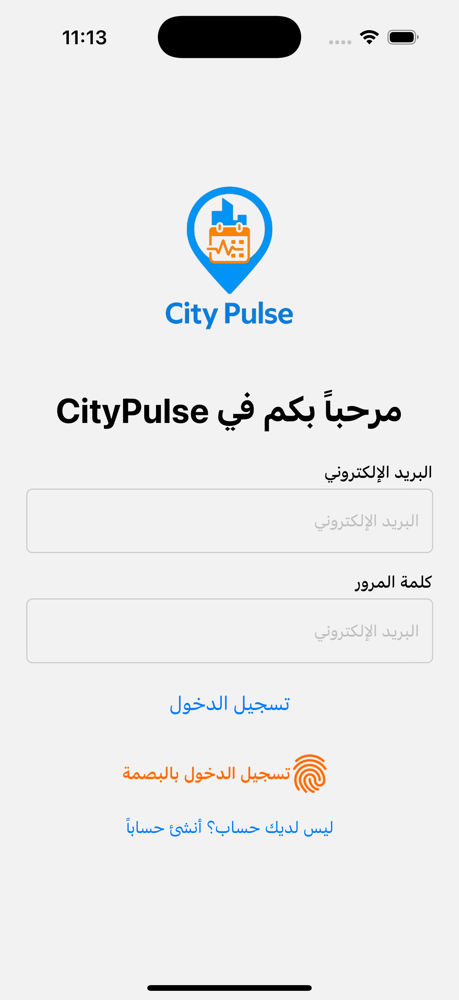
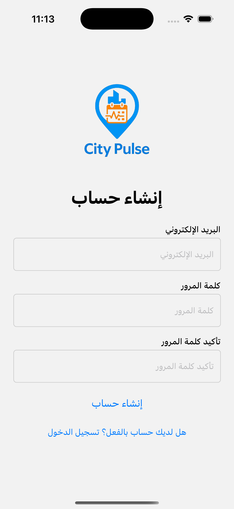
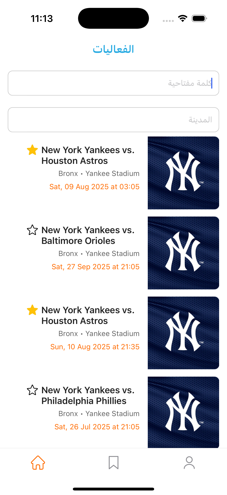
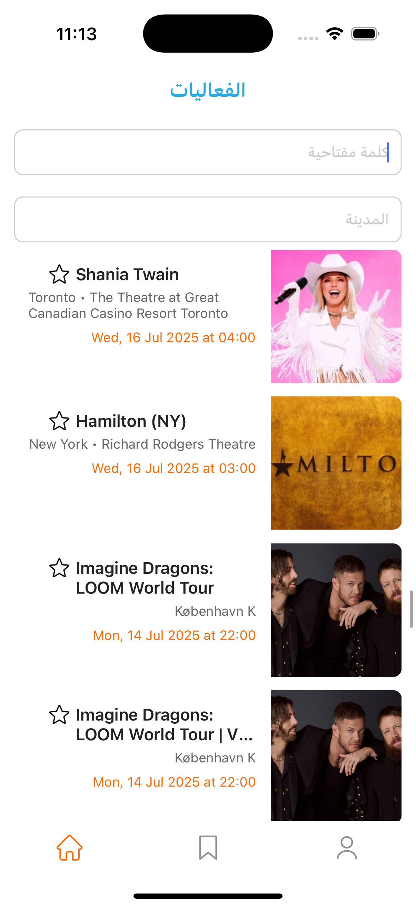
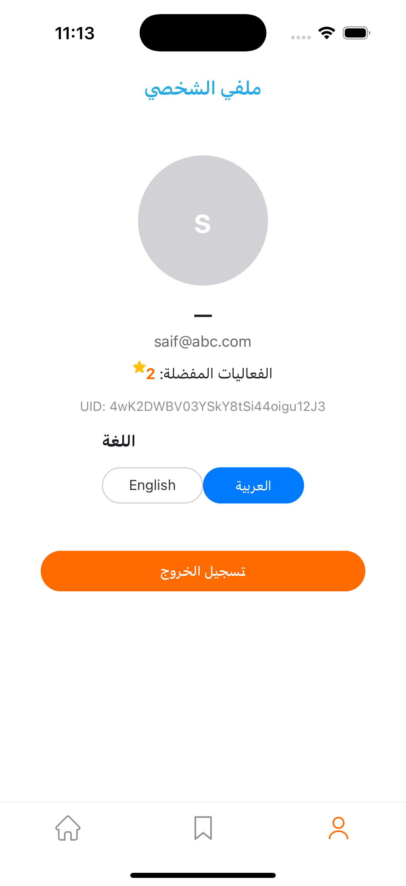

# 🌆 City Pulse – Local Events Explorer

City Pulse is a modern React Native mobile app that helps users discover, bookmark, and explore local events. Built with Firebase authentication, a clean splash experience, and dynamic navigation, it's designed to be fast, responsive, and engaging.

---

## 📱 App Screenshots

### LTR (English UI)

| Login | Signup | Home | Event Details | Profile |
| ----- | ------ | ---- | ------------- | ------- |
|       |        |      |               |         |

### RTL (Arabic UI)

| تسجيل الدخول | إنشاء حساب | الصفحة الرئيسية | تفاصيل الفعالية | الملف الشخصي |
| ------------ | ---------- | --------------- | --------------- | ------------ |
|  |  |  |  |  |

<<<<<<< HEAD
=======
---

## 📹 Demo Video

Click the link below to watch the full walkthrough of the app:

🔗 [Watch Demo Video](https://res.cloudinary.com/dd3t2lri7/video/upload/v1752482974/walkthrough_s3yeov.mp4)

>>>>>>> f6d2b6c3cfaea973d6e901cdfc275aabcd1d4ed9

## 🌐 Live Demo

🚧 *Currently not hosted live. You can run the app locally using the instructions below.*

---

## 🗖 Tech Stack

* ⚛️ **React Native** – Cross‑platform mobile development
* 🔥 **Firebase Auth** – Secure authentication (Email/Password & **Fingerprint/Biometric**)
* 🚦 **React Navigation** – Stack & Tab navigation
* 🌍 **Context API** – Global user state management
* 🌐 **RTL Support** – Built‑in right‑to‑left layout handling (Arabic ready)
* ⏳ **Splash Logic** – 1‑second guaranteed display
* 🎫 **Ticketmaster Public API** – Fetching live event data
* 📍 **Event Location Preview** – Map preview is embedded in the event details screen

---

## ✨ Getting Started

### 1. Clone the Repository

```bash
git clone https://github.com/your-username/city-pulse-app.git
cd city-pulse-app
```

### 2. Install Dependencies

```bash
yarn install
# or
npm install
```

### 3. Setup Firebase

* Create a Firebase project from the [Firebase Console](https://console.firebase.google.com/)
* Enable **Email/Password Authentication** under Authentication > Sign-in method
* Add your app to Firebase for both Android and iOS

#### 🔧 Android Firebase Setup

* Download `google-services.json` from Firebase Console and place it in `android/app/`
* Add the following to `android/build.gradle`:

```gradle
classpath 'com.google.gms:google-services:4.3.15' // under dependencies
```

* And in `android/app/build.gradle`, add:

```gradle
apply plugin: 'com.google.gms.google-services'
```

#### 🍏 iOS Firebase Setup

* Download `GoogleService-Info.plist` and place it in `ios/`
* Open Xcode → drag the `.plist` file into the project (ensure "Copy if needed" is checked)
* Add the Firebase iOS SDK if not already installed:

```bash
cd ios
pod install
cd ..
```

### 4. Setup React Native Biometric (Optional for fingerprint login)

```bash
yarn add react-native-biometrics
```

> ✅ For iOS: Run `pod install` in the `ios` directory after installing ✅ For Android: No extra steps needed

### 5. Setup React Native Keychain (for secure credential storage)

```bash
yarn add react-native-keychain
cd ios && pod install && cd ..
```

> 📌 iOS requires Keychain Sharing to be enabled in Xcode under "Signing & Capabilities"

### 6. Final Setup

* Run the app on your device or simulator:

```bash
npx react-native run-android
# or
npx react-native run-ios
```

---

## 🔧 Firebase + Splash Logic

`UserContext.tsx` ensures:

* Auth state is checked on app launch
* Splash screen is shown for **minimum 1 second**:

```tsx
useEffect(() => {
  const delay = new Promise(res => setTimeout(res, 1000));
  const authCheck = new Promise<void>((res) => {
    const sub = auth().onAuthStateChanged((fbUser) => {
      setUser(fbUser);
      res();
    });
    return () => sub();
  });

  Promise.all([delay, authCheck]).then(() => setInitialising(false));
}, []);
```

---

## 📂 Folder Structure

```
project-root/
│
├── src/
│   ├── assets/
│   │   ├── bookmark.png
│   │   ├── fingerprint.png
│   │   ├── home.png
│   │   ├── left-arrow.png
│   │   ├── right-arrow.png
│   │   ├── star.png
│   │   ├── unstar.png
│   │   ├── user.png
│   │   └── logo.png
│   │
│   ├── components/
│   │   ├── Button.tsx
│   │   ├── Card.tsx
│   │   ├── FormTextInput.tsx
│   │   ├── Header.tsx
│   │   ├── LanguageSelector.tsx
│   │   ├── Loader.tsx
│   │   └── SearchBar.tsx
│   │
│   ├── core/
│   │   ├── context/
│   │   │   ├── UserContext.tsx
│   │   │   └── LocalizationContext.tsx
│   │   ├── hooks/
│   │   │   ├── useAuth.ts
│   │   │   ├── useEventsQuery.ts
│   │   │   ├── useFavorite.ts
│   │   │   ├── useInfiniteEvents.ts
│   │   │   └── useLocalization.ts
│   │   ├── i18n/
│   │   │   └── translations/
│   │   │       └── index.ts
│   │   ├── schema/
│   │   │   ├── loginValidation.schema.ts
│   │   │   └── signupValidation.schema.ts
│   │   ├── services/
│   │   │   ├── api.ts
│   │   │   ├── biometrics.ts
│   │   │   ├── credentials.ts
│   │   │   └── storage.ts
│   │   ├── types/
│   │   │   └── navigation.types.ts
│   │   └── utils/
│   │       └── helper.ts
│   │
│   ├── navigation/
│   │   ├── AuthStack.tsx
│   │   ├── HomeStack.tsx
│   │   ├── MainTab.tsx
│   │   └── RootNavigator.tsx
│   │
│   ├── screens/
│   │   ├── EventDetails/
│   │   │   └── index.tsx
│   │   ├── Favorite/
│   │   │   └── index.tsx
│   │   ├── Home/
│   │   │   └── index.tsx
│   │   ├── Login/
│   │   │   └── index.tsx
│   │   ├── Profile/
│   │   │   └── index.tsx
│   │   ├── SignUp/
│   │   │   └── index.tsx
│   │   └── Splash/
│   │   │   └── index.tsx
│   │
│   └── App.tsx
├── android/
└── ios/
```

---

## 📊 Future Enhancements

* 🌃 Light/Dark theme toggle

---

## 🧑‍💻 Author

**Saif Bin Abdulkarim**
Senior Mobile Developer | React Native Specialist
🌝 UAE 

---

## 📄 License

MIT License – feel free to fork and use!

---

## 🔗 Connect

* GitHub: [github.com/](https://github.com/your-username)saifbak
* LinkedIn: [linkedin.com/in/](https://linkedin.com/in/your-profile)saifbinabdulkarim

---
